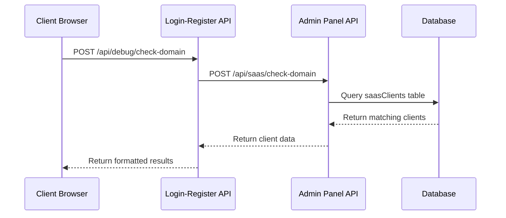

# Domain Verification Feature

## Overview
Added a comprehensive domain verification system that checks if the current domain exists in the admin panel's SAAS clients database. This feature helps with troubleshooting, client onboarding, and domain configuration validation.

## Implementation

### 1. Admin Panel API Endpoint
**File**: `/admin/app/api/saas/check-domain/route.ts`

- **Endpoint**: `POST /api/saas/check-domain`
- **Purpose**: Searches the `saasClients` table for domains
- **Features**:
  - Exact domain matching
  - Partial domain matching (subdomains, URL variations)
  - CORS support for cross-origin requests
  - Comprehensive client data retrieval

```typescript
// Search strategy
or(
  eq(saasClients.websiteDomain, normalizedDomain),
  like(saasClients.websiteDomain, `%${normalizedDomain}%`),
  like(saasClients.websiteUrl, `%${normalizedDomain}%`)
)
```

**Response Format**:
```json
{
  "exists": true,
  "domain": "example.com",
  "client": {
    "id": "client-id",
    "companyName": "Example Corp",
    "contactEmail": "admin@example.com",
    "websiteDomain": "example.com",
    "status": "active",
    "subscriptionStatus": "active",
    "licenseKey": "LIC-XXXX...",
    // ... more client details
  },
  "exactMatch": true,
  "allMatches": 1
}
```

### 2. Client-Side API Route
**File**: `/login-register/src/app/api/debug/check-domain/route.ts`

- **Endpoint**: `POST /api/debug/check-domain`
- **Purpose**: Proxy requests to admin panel with error handling
- **Features**:
  - Automatic admin panel URL resolution
  - Error handling and status code forwarding
  - Request/response logging

### 3. Enhanced Test Page
**File**: `/login-register/src/app/test-admin-connection/page.tsx`

Added a new "Domain Database Check" section with:

#### UI Components:
- **Check Button**: "Check Domain in Admin Database"
- **Loading State**: "Checking Domain..." with disabled state
- **Results Display**: Comprehensive domain verification results

#### Domain Found Display:
```typescript
// Shows complete SAAS client information
- Company Name
- Contact Email  
- Website Domain & URL
- Client Status (Active/Suspended)
- Subscription Status & Type
- License Key (masked)
- Creation Date
- Last Access Date
- Subscription Expiry
- Match Type (Exact/Partial)
```

#### Domain Not Found Display:
```typescript
// Troubleshooting suggestions
- Domain not registered as SAAS client
- Domain spelling mismatch in admin panel
- Client deleted from database
- Subdomain mismatch (www vs non-www)
```

## User Interface

### 1. Test Page Layout
The domain verification section is integrated into `/test-admin-connection`:

```
┌─ Connection Tests ─┐
├─ License Testing  ─┤  
├─ Domain Check     ─┤  ← NEW SECTION
└─ Environment Info ─┘
```

### 2. Domain Check Section
- **Button**: Prominent "Check Domain in Admin Database" button
- **Status Indicators**: Color-coded results (Green = Found, Red = Not Found)
- **Detailed Information**: Expandable client details when domain exists
- **Troubleshooting**: Helpful suggestions when domain not found

### 3. Visual Design
- **Success State**: Green background with checkmark icon
- **Error State**: Red background with warning icon
- **Loading State**: Spinner with disabled button
- **Information Cards**: Organized grid layout for client details

## Features

### ✅ Domain Matching
- **Exact Match**: Perfect domain match (example.com = example.com)
- **Partial Match**: Subdomain variations (www.example.com matches example.com)
- **URL Match**: Matches against websiteUrl field as well
- **Case Insensitive**: Handles domain case variations

### ✅ Comprehensive Client Data
When domain is found, displays:
- Basic Info: Company, Contact Email
- Domain Info: Website Domain, Website URL  
- Status Info: Client Status, Subscription Status
- Subscription Info: Type, Expiry Date
- Access Info: Creation Date, Last Access
- License Info: Masked License Key
- Match Info: Exact vs Partial match, Total matches

### ✅ Error Handling
- **Network Errors**: Connection failures to admin panel
- **API Errors**: Admin panel API error responses
- **Domain Errors**: Invalid domain format handling
- **Timeout Handling**: Request timeout protection

### ✅ Troubleshooting Support
When domain not found, provides:
- Clear error message with checked domain
- List of possible reasons
- Actionable troubleshooting steps
- Raw response data for debugging

## API Flow



## Database Query

The admin panel searches the `saasClients` table using:

```sql
SELECT * FROM saasClients 
WHERE websiteDomain = 'example.com' 
   OR websiteDomain LIKE '%example.com%'
   OR websiteUrl LIKE '%example.com%'
```

## Security Considerations

### ✅ Data Protection
- License keys are masked (shows only first 10 characters)
- No sensitive admin credentials exposed
- CORS headers properly configured

### ✅ Access Control
- Available on debug/test pages only
- No authentication required (for troubleshooting)
- Rate limiting handled by Next.js

### ✅ Error Handling
- No internal error details exposed to client
- Sanitized error messages
- Proper HTTP status codes

## Use Cases

### 1. Client Onboarding
- **Verify Domain Setup**: Check if domain is properly registered
- **Validate Configuration**: Ensure domain matches admin panel settings
- **Troubleshoot Issues**: Identify domain-related setup problems

### 2. Support & Troubleshooting
- **Domain Verification**: Quickly check if client exists in database
- **Configuration Audit**: Review client settings and status
- **License Debugging**: Verify license key association

### 3. Domain Migration
- **Pre-Migration Check**: Verify old domain exists
- **Post-Migration Validation**: Confirm new domain is registered
- **Subdomain Testing**: Test www vs non-www configurations

## Testing Scenarios

### ✅ Scenario 1: Domain Exists (Active Client)
1. Navigate to `/test-admin-connection`
2. Click "Check Domain in Admin Database"
3. **Expected**: Green success card with complete client details

### ✅ Scenario 2: Domain Not Found
1. Use domain not in SAAS clients database
2. Click domain check button
3. **Expected**: Red error card with troubleshooting suggestions

### ✅ Scenario 3: Admin Panel Unreachable
1. Configure invalid admin panel URL
2. Attempt domain check
3. **Expected**: Error message about connection failure

### ✅ Scenario 4: Partial Domain Match
1. Register "example.com" in admin panel
2. Test from "www.example.com" 
3. **Expected**: Success with "Exact Match: No" indicator

## Benefits

✅ **Faster Troubleshooting**: Instantly verify domain registration
✅ **Better Support**: Complete client information in one view
✅ **Configuration Validation**: Ensure proper domain setup
✅ **User-Friendly**: Clear visual indicators and helpful messages
✅ **Comprehensive**: Shows all relevant client and subscription data
✅ **Debugging Support**: Raw response data available for technical analysis

## Integration

The domain verification feature is fully integrated into the existing SAAS architecture:

- **Middleware**: Works alongside existing license verification
- **Debug Tools**: Complements other testing and diagnostic tools
- **Admin Panel**: Uses existing SAAS client management system
- **UI Components**: Consistent with existing design system

## Future Enhancements

Potential improvements:
- **Real-time Updates**: WebSocket integration for live status updates
- **Bulk Domain Check**: Check multiple domains simultaneously
- **Domain History**: Track domain changes over time
- **Export Functionality**: Export client data to CSV/JSON
- **Advanced Filtering**: Search by company, email, or other criteria

The domain verification feature provides a powerful tool for managing and troubleshooting SAAS client domains, improving the overall reliability and supportability of the system.
